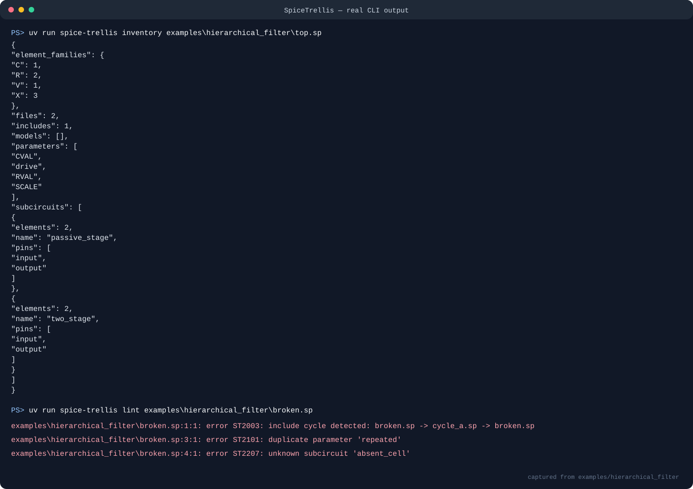

# SpiceTrellis

[](https://github.com/appleweiping/SpiceTrellis/actions/workflows/ci.yml)
[](https://github.com/appleweiping/SpiceTrellis/actions/workflows/codeql.yml)
[](https://www.python.org/)
[](LICENSE)

SpiceTrellis is a provenance-preserving front end for a documented,
portable subset of SPICE. It reads hierarchical circuit decks, follows safe
local includes, reports syntax and semantic problems together, produces a
stable inventory, and expands subcircuit instances into a deterministic flat
deck with a machine-readable source map.

The project does not run a simulator. It is intended for tooling that needs to
understand a deck before choosing how or where to simulate it.

## Current capabilities

- Physical-line continuation with leading `+` and source ranges spanning every
  contributing line.
- Full-line `*` comments and `$`/`;` inline comments outside quoted strings,
  parameter braces, and parentheses.
- Primitive `R`, `C`, `L`, `V`, `I`, and `M` cards plus hierarchical `X`
  instances.
- `.include`, `.param`, `.subckt`, `.ends`, `.model`, `.global`, and `.end`.
- A deliberately small arithmetic expression language with parameter names,
  `+`, `-`, `*`, `/`, integer powers, parentheses, braces, and common SPICE
  scale suffixes.
- Include-root confinement, include-cycle detection, duplicate-symbol checks,
  parameter dependency analysis, subcircuit arity checking, and recursive-call
  detection.
- Deterministic flattening with hierarchical element/node names and a source
  map that records both definition sites and instance expansion chains.
- Stable text and JSON diagnostics suitable for local scripts and CI.
- No runtime Python dependencies.

Unknown directives and element families are preserved as opaque cards and
reported as warnings. This makes unsupported syntax visible instead of
silently changing a circuit.

## Installation

SpiceTrellis requires Python 3.11 or newer.

```bash
python -m pip install .
spice-trellis --version
```

For development:

```bash
python -m pip install -e ".[dev]"
ruff check .
ruff format --check .
mypy src
bandit -q -r src
pytest --cov=spicetrellis --cov-report=term-missing
python -m build
```

## Quick start

The repository contains an entirely synthetic hierarchical passive-filter
example. It uses no PDK, model library, or proprietary data.



```bash
spice-trellis lint examples/hierarchical_filter/top.sp
spice-trellis inventory examples/hierarchical_filter/top.sp
spice-trellis flatten examples/hierarchical_filter/top.sp \
  --output build/filter.flat.sp \
  --provenance build/filter.map.json
```

The flat deck contains primitive cards such as:

```spice
Xfilter__Xfirst__Rseries in Xfilter__n__middle 2000
Xfilter__Xfirst__Cshunt Xfilter__n__middle 0 0.000000001
```

Names encode the instance path, but source-map entries retain the original
subcircuit definition and every expansion site. Generated names are stable for
the same input and do not depend on Python hash iteration order.

The intentionally broken example demonstrates multi-error reporting:

```bash
spice-trellis lint examples/hierarchical_filter/broken.sp
```

## CLI reference

### Parse one file

```bash
spice-trellis parse circuit.sp
```

Produces JSON for the syntax tree and attached source spans. It does not follow
includes.

### Analyze a project

```bash
spice-trellis lint circuit.sp
spice-trellis lint circuit.sp --json
spice-trellis lint project/circuit.sp --include-root project --include-root shared
```

The entry file's directory is permitted automatically. Additional include
roots must be supplied explicitly. Resolved include paths outside all roots are
errors, including paths that escape through a symbolic link.

### Flatten hierarchy

```bash
spice-trellis flatten circuit.sp
spice-trellis flatten circuit.sp -o circuit.flat.sp --provenance circuit.map.json
```

Flattening is refused when analysis contains an error. SpiceTrellis never emits
a knowingly partial flat deck. Parameter values consumed by supported cards are
evaluated before output.

### Format one file

```bash
spice-trellis format circuit.sp
spice-trellis format circuit.sp --check
spice-trellis format circuit.sp --output canonical.sp
```

`--check` returns status 1 when canonical output differs from the input and
does not modify the file.

### Inventory

```bash
spice-trellis inventory circuit.sp
```

The JSON result includes source-file and include counts, subcircuit pin lists,
element-family counts, parameters, and models.

## Python API

```python
from spicetrellis import analyze_file, flatten, format_deck, inventory, parse_text

syntax = parse_text("R1 input 0 10k\n.end\n", filename="memory.sp")

analysis = analyze_file("examples/hierarchical_filter/top.sp")
if not analysis.has_errors:
    flat = flatten(analysis)
    print(format_deck(flat.statements))
    print(inventory(analysis).as_dict())
```

Input problems are represented by immutable diagnostics. Each diagnostic has a
stable code, severity, message, primary source range, and optional related
ranges.

## Portable-SPICE expression subset

Expressions may be bare or enclosed in braces:

```spice
.param base=1k ratio=2
R1 a b {base*ratio}
```

Supported scale suffixes are `t`, `g`, `meg`, `k`, `m`, `mil`, `u`, `n`, `p`,
and `f`. As in traditional SPICE notation, `m` means milli and `meg` means
mega. Arbitrary functions, conditionals, Python syntax, and user-defined code
are rejected. Exponents must be integers.

Parameter lookup is case-insensitive. Original identifier spelling is retained
for presentation. During subcircuit expansion, explicit instance overrides
take precedence over subcircuit defaults, which take precedence over global
values. A nested caller passes a local value through an explicit override.

## Exit codes

- `0`: command completed without error diagnostics.
- `1`: readable input contained syntax or semantic errors, or `format --check`
  detected a difference.
- `2`: command-line usage, file access, or text-decoding failure.

Warnings do not change the exit status, but they are always rendered.

## Security properties

SpiceTrellis reads text and writes explicitly requested artifacts. It does not:

- access the network;
- invoke a shell or simulator;
- evaluate Python code;
- load native plugins;
- follow an include outside configured roots.

Circuit text is untrusted input. Resource limits for hostile multi-gigabyte
decks are not part of version 0.1, so callers handling public uploads should
also enforce file-size and process limits. See [SECURITY.md](SECURITY.md) for
responsible reporting.

## Scope and limitations

Version 0.1 intentionally does not implement:

- numeric simulation or performance prediction;
- `.lib` section selection, `.control` execution, behavioral expressions, or
  Verilog-A;
- full vendor-specific SPICE dialects;
- PDK model semantics or model-file licensing decisions;
- automatic correction of a user's circuit;
- graphical visualization.

Opaque cards can be formatted and inspected, but SpiceTrellis makes no claim
that it understands their electrical meaning. A supported `X` instance must be
fully resolved before flattening.

## Determinism and provenance

The architecture separates syntax, semantic resolution, and elaboration.
Source spans are attached before parsing and survive every later phase. Symbol
tables use case-folded keys for lookup and stable sorted order for diagnostics.
Output order follows source and instance order rather than hash-table order.

See [docs/architecture.md](docs/architecture.md) for data-flow and invariants.

## Contributing

Contributions are welcome when they include a documented syntax boundary,
tests for valid and invalid inputs, and deterministic output. Read
[CONTRIBUTING.md](CONTRIBUTING.md) and the
[Code of Conduct](CODE_OF_CONDUCT.md) before opening a pull request.

SpiceTrellis is released under the [MIT License](LICENSE).
